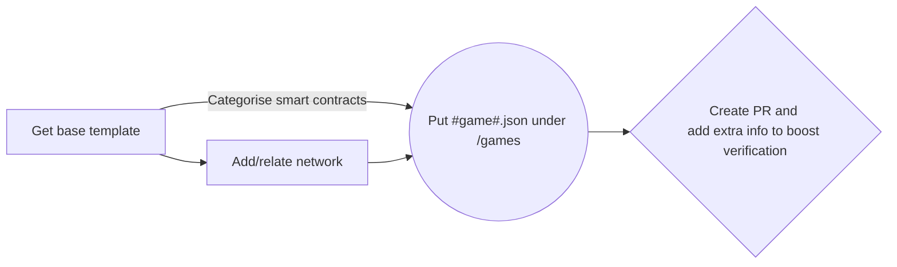

# OpenGameMeta
**OpenGameMeta is an Open Web3 Gaming Metadata Protocol**

OpenGameMeta is a list of gaming networks and a game metadata catalog. Game studios and developers can use the information from this repository to get more accurate information about smart contracts and tokens to build better Web3 games and validate game-related contracts and details.

The goal is to build an open and social Web3 gaming graph for the game developers’ community to build trust, and a secure way to validate gaming data.

OpenGameMeta is a game-dev-curated, open protocol that any game developer can use and build with. It's part of the future of Web3 game development.

## Game networks
Networks listed here are used in Web3 games and can connect with users’ Web3 wallets. Superb Wallet Extension is the leading integrator, but many others may support multiple chains using data from here. This uses information that may also be seen on chainlist.org (https://github.com/ethereum-lists/chains).

We want to unify and support other blockchains in addition to EVM-compatible chains. We also invite Web3 and game developers to think about how to solve cross-chain and interoperability issues.

"Module" is a Superb-related parameter to define the type of the network, so we know which engine to use. 

Possible options are:

    - EVM (evm)
    - Solana (solana)
    - Cosmos (cosmos)
    - Bitcoin (bitcoin)
    - Polkadot (polkadot)
    - WAX (wax)—even if it’s an EOS fork, we thought it would be better to separate
    - EOS (eos)
    - ICON (icon)
    - Obyte (obyte)

**Location: /networks
An example for Ethereum Mainnet is under “/networks/ethereum-1.json”.**

## Game metadata
Game metadata is vital so wallets and other Web3 games and projects can verify and interact with those contracts and tokens. Be aware of metadata and other details needed to be presented as intended.

Game metadata has the following core elements like name, description, and logo; additionally, network reference and smart contract information for all assets for each referenced network.

**Location: /games
An example for The Smurfs Society is under “/networks/the-smurfs-society.json”.**

## Adding your game data

When adding your game metadata and network information, please find the template in /template folder.

When adding new game PR, please also add the game’s Terms of Conditions and Privacy Policy links, as well as Whitepaper/Litepaper if one exists. Additionally, please add your game type—free-to-play, DeFi, play-to-earn, etc.

